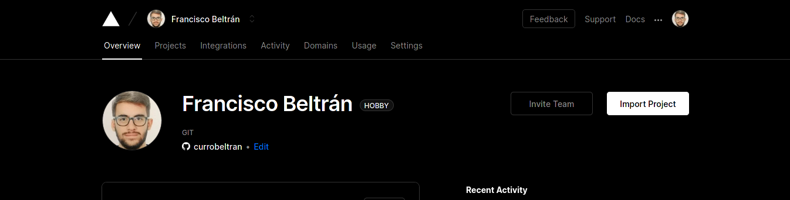
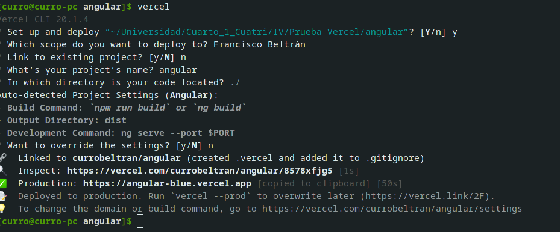
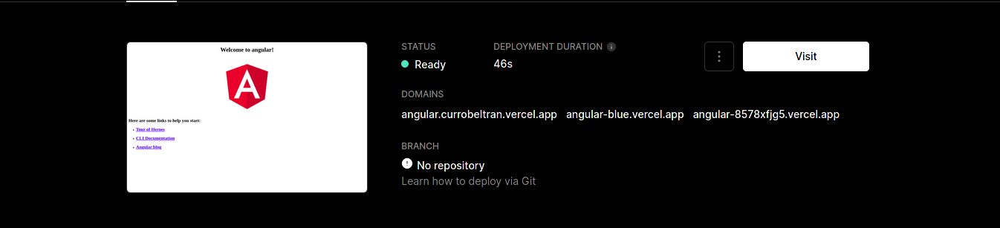
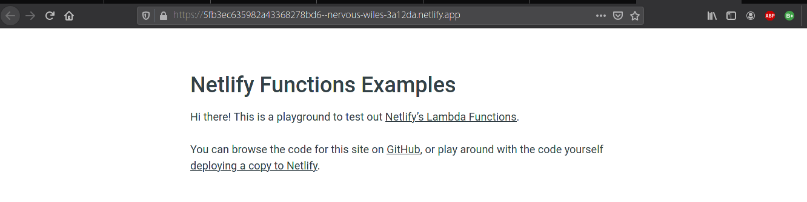

# Ejercicios Tema Serverless

## Ejercicio 1. Darse de alta en Vercel y Firebase, y descargarse los SDKs para poder trabajar con ellos localmente

Comenzaremos dándonos de alta en Vercel, que se puede comprobar en el siguiente pantallazo:

Descargamos su SDK con el comando npm i -g vercel. Posteriormente tendremos que verificar nuestra cuenta, para lo cual ejecutamos el comando vercel y nos pide el correo al cual nos manda una confirmación. Realizado este paso ya podremos utilizar vercel de forma local ejecutando vercel dev.

Para Firebase no será necesario darse de alta, ya que es un servicio de Google y con nuestra cuenta de Gmail ya tendremos el acceso necesario. Para utilizar su SDK y trabajar con esta plataforma de manera local, tendremos que realizar un proceso similar al anterior ejecutando el comando npm i -g firebase-tools (hacemos lo mismo con firebase-admin y firebase-functions). Por último, con firebase emulators:start podemos iniciar el servicio de manera local.

## Ejercicio 2. Tomar alguna de las funciones de prueba de Vercel, y hacer despliegues de prueba con el mismo

Se hara de manera muy simple desde el CLI de vercel, ya que ejecutando vercel init accederemos a una interfaz que nos permitirá elegir que ejemplo queremos probar y nos guía durante su instalación. Seguimos todos los pasos, incluimos la información necesaria y esperamos a que se construya. Cuando esto finalice, en la carpeta creada con el proyecto ejecutamos `vercel` y se procederá a su despliegue.

## Ejercicio 3. Tomar alguna de las funciones de prueba de Netlify, y hacer despliegues de prueba con el mismo

Para realizar esta tarea, unicamente nos deberemos registrar en Netlify (se puede hacer con nuestra cuenta de GitHub) y posteriormente, acceder a [este repositorio](https://github.com/netlify/functions) desde el cual tenemos una opción en la que podemos desplegar desde Netlify dicho repositorio de prueba. Pulsamos y nos llevará a un proceso en el cual seguiremos los pasos para crear este repositorio en nuestra cuenta de GitHub y, desde ahí, desplegarla. Cuando este proceso haya acabado, esperamos unos segundos y ya tendremos disponible la dirección desde la cual se ejecuta nuestra función.

Comentar además que para hacer este despliegue público necesitamos un dominio, el cual no hemos configurado. En cambio, se ha usado una url autogenerada por el servicio para comprobar que todo el despliegue funciona correctamente.
