# Ejercicios Tema 2

## 1. Descargar y ejecutar las pruebas de alguno de los proyectos anteriores, y si sale todo bien, hacer un pull request a alguno de esos proyectos con tests adicionales, si es que faltan (en el momento que se lea este tema).

Para este ejercicio ejecutaremos las pruebas del repositorio HitosIV, los cuales al estar escritos en go simplemente necesitarán la ejecución del comando `go test`:

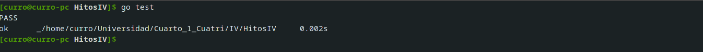

## 2. Para la aplicación que se está haciendo, escribir una serie de aserciones y probar que efectivamente no fallan. Añadir tests para una nueva funcionalidad, probar que falla y escribir el código para que no lo haga (vamos, lo que viene siendo TDD).

Para nuestra aplicación hemos desarrollado gran cantidad de test; por ejemplo este comprueba si se realiza correctamente los métodos Get y Set de los atributos de la clase Tiempo:

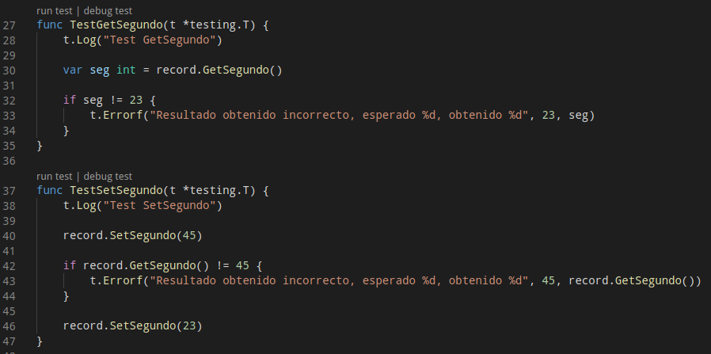

Al añadir una nueva funcionalidad, tendremos primero que realizar los tests con el resultado esperado al ejecutar la función. En este caso se creara una cadena donde salga el tiempo con un formato determinado. Al no haber escrito aún la función para ello, obtendremos un error al pasar las pruebas:

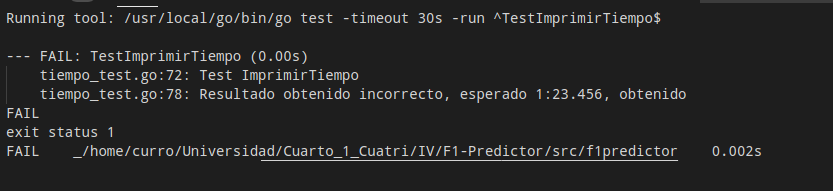

Escribimos, por tanto, el método que cumplirá esta funcionalidad:

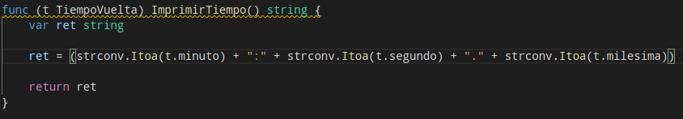

Y vemos como el resultado ya es el esperado:

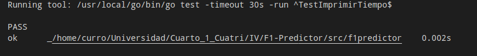

## 3. Crear algún conjunto de scripts de tests, usando tu lenguaje favorito, y ejecutarlos desde el marco de test más adecuado (o el que más te guste) para ese lenguaje.

Para este ejercicio utilizaremos el conjunto de scripts de tests correspondientes a nuestro proyecto, que se ejecutará simplemente escribiendo go test en la carpeta donde se encuentre el paquete (el marco de test es implícito al compilador, como se puede observar).

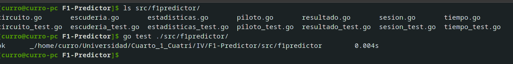

## 4. Instalar alguno de los entornos virtuales de node.js (o de cualquier otro lenguaje con el que se esté familiarizado) y, con ellos, instalar la última versión existente, la versión minor más actual de la 4.x y lo mismo para la 0.11 o alguna impar (de desarrollo).

Para este ejercicio, instalaremos nvm con el comando `curl -o- https://raw.githubusercontent.com/nvm-sh/nvm/v0.36.0/install.sh | bash`

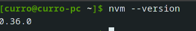

Para instalar la última versión, ejecutaremos el siguiente comando:

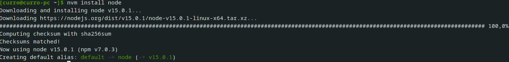

Para instalar la versión minor más actual de la 4.x, ejecutaremos `nvm ls-remote` para averiguar dicha versión (4.9.1), y ejecutamos lo siguiente:

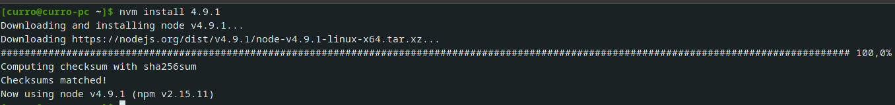

Y para la 0.11:

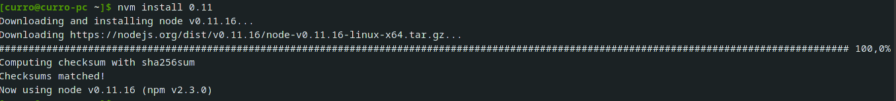

## 5. Como ejercicio, algo ligeramente diferente: un servicio web para calificar las empresas en las que hacen prácticas los alumnos. Si se quiere hacer con cualquier otra aplicación, también es válido.

En este ejercicio, en vez de realizar un servicio web desde 0, usaremos la aplicación del proyecto que se está realizando, ya que se pueden realizar los ejercicios posteriores con la misma.

## 6. Ejecutar el programa en diferentes versiones del lenguaje. ¿Funciona en todas ellas?

El programa se escribió en go, en su versión 1.15 (y en la cual obviamente funciona). Si probasemos una version anterior, como podría ser la 1.2 nos da un error ya que no puede cargar uno de los imports que se realizan en el proyecto. En otras versiones, como la 1.12 si que funciona el programa.

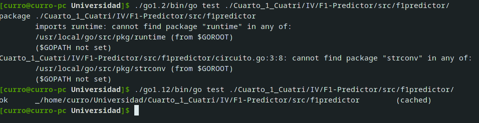

## 7. Crear una descripción del módulo usando package.json. En caso de que se trate de otro lenguaje, usar el método correspondiente.

En el lenguaje usado, Go, no existe un tipo de archivo que contenga toda la información que tiene package.json; en cambio, tenemos go.mod que contendrá la lista de dependencias de nuestro módulo. Como no tenemos ninguna dependencia, no se creará este archivo; pero si fuese necesario su formato sería el siguiente:

```
go (version del lenguaje)

require(
    Introducir aquí las direcciones de las dependencias con sus respectivas versiones
)
```

## 8. Automatizar con grunt, gulp u otra herramienta de gestión de tareas en Node la generación de documentación de la librería que se cree usando docco u otro sistema similar de generación de documentación. Previamente, por supuesto, habrá que documentar tal librería.

Al estar usando Go, como herramienta de gestión de tareas usaremos makefile; mientras que para generar la documentación si usaremos docco pero en su versión para Go (Gocco). Se instalará en nuestro proyecto introduciendo en la carpeta de documentación los ficheros necesarios para compilar el programa y ejecutarlo posteriormente.

Este proceso quedará reflejado en nuestro makefile, donde construiremos el programa, lo ejecutaremos y por último lo eliminaremos. La tarea del makefile quedaría así:

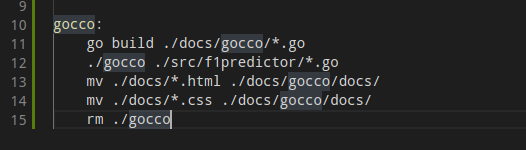

Y la documentación resultante tendría el siguiente formato:

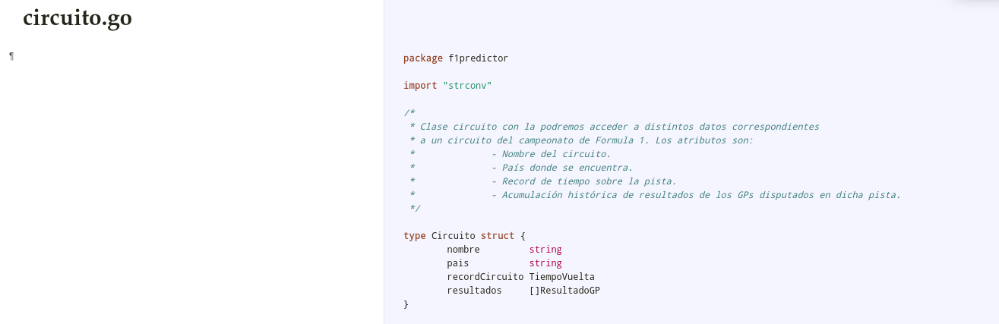

## 9. Haced los dos primeros pasos antes de pasar al tercero.

Para este ejercicio hemos decidido usar Travis. El primer paso se completa de manera muy sencilla, ya que automáticamente cuando vamos a registrarnos nos pregunta si queremos hacerlo con la cuenta de GitHub y si aceptamos los permisos que necesita Travis sobre nuestra cuenta. Sabremos que nuestra cuenta está enlazada con GitHub, por ejemplo, si en nuestra foto de usuario nos sale el icono de GitHub:

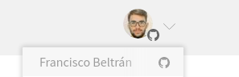

El segundo paso es activar el repositorio, lo cual se puede realizar desde la configuración de nuestra cuenta; donde nos saldrán nuestros repositorios y podremos activar o desactivar Travis con solo pulsar un botón.


## 10. Configurar integración continua para nuestra aplicación usando Travis o algún otro sitio.

Este ejercicio se correspondería con la creación de un fichero de configuración para que se ejecute correctamente el proceso de integración continua. Este archivo se llamará travis.yml, y estará en la raíz de nuestro proyecto.

Este documento tendrá como objetivo ejecutar los tests de nuestro proyecto, para comprobar que todo funciona correctamente. Para ello, necesitaremos un documento en la raíz del proyecto, llamado .travis.yml, que contendrá lo siguiente:

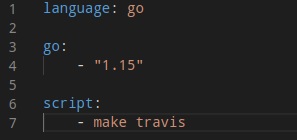

(Con la orden make travis se ejecuta el contenedor docker dispuesto para ejecutar los tests del proyecto)

Por último, tendríamos que hacer push del repositorio y esperar a que se ejecute travis; que con la configuración anterior no necesitaría ninguna acción más por nuestra parte. En el siguiente pantallazo vemos como se ha ejecutado correctamente:

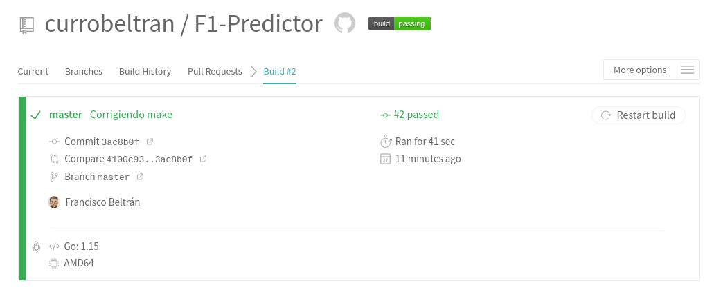