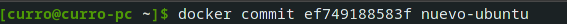

# Ejercicios Tema 3

## 1. Instalar docker y/o otro gestor de contenedores como Podman/Buildah.

Docker:

Podman:

## 2. Instalar a partir de docker una imagen alternativa de Ubuntu y alguna adicional, por ejemplo de CentOS. Buscar e instalar una imagen que incluya MongoDB.

Ubuntu:

CentOS:

Imagen con MongoDB:

## 3. Crear un usuario propio e instalar alguna aplicación tal como nginx en el contenedor creado de esta forma, usando las órdenes propias del sistema operativo con el que se haya inicializado el contenedor.

Usaremos la imagen de Ubuntu instalada anteriormente, y seguiremos los siguientes pasos:

Iniciar la máquina de manera interactiva:

Instalar nginx:

Crear un nuevo usuario:

## 4. Crear a partir del contenedor anterior una imagen persistente con commit.

Para crear el commit, ejecutamos este comando con la ID del contenedor (que se puede ver ejecutando `docker ps -a`):

Comprobamos que efectivamente está creado en la siguiente captura de pantalla:

## 5. Crear un Dockerfile para el servicio web que testee la clase que se ha venido desarrollando hasta ahora.

El dockerfile para testear el proyecto de los ejercicios del tema anterior puede ser el siguiente:

(Este es el contenedor que ejecuta los test, pero a efectos prácticos el proceso a seguir es muy similar si se quisiese ejecutar una aplicación)

## 6. Desplegar un contenedor en alguno de estos servicios, de prueba gratuita o gratuitos.

Ejecutaremos nuestro contenedor de pruebas del proyecto en la plataforma Quay.io (con prueba gratuita). Para ello nos registramos en su página (se puede hacer utilizando la cuenta de GitHub) y seguimos los pasos para configurar el despliegue de nuestro repositorio (del proyecto en este caso).

