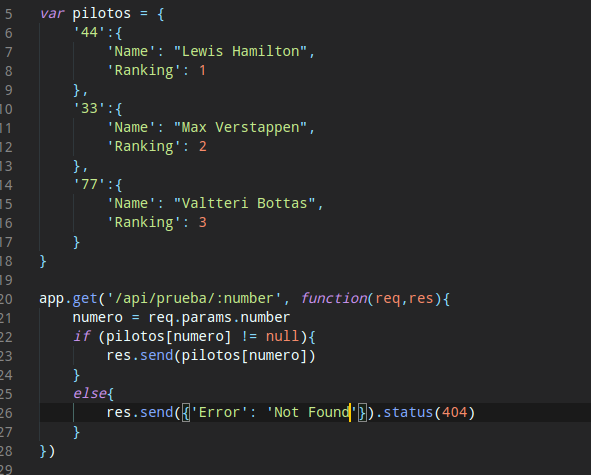

# Ejercicios microservicios

## 1. Instalar etcd3, averiguar qué bibliotecas funcionan bien con el lenguaje que estemos escribiendo el proyecto (u otro lenguaje), y hacer un pequeño ejemplo de almacenamiento y recuperación de una clave; hacer el almacenamiento desde la línea de órdenes (con etcdctl) y la recuperación desde el mini-programa que hagáis.

En primer lugar, instalaremos etcd3 en nuestro sistema (para el proyecto se podría instalar en el contenedor que simula el entorno de la aplicación). Para ello, tendremos que ejecutar el siguiente [script](./docs/script.sh) de instalación obtenido directamente desde el repositorio de etcd3, siguiendo las recomendaciones indicadas en el README del mismo. Anteriormente debemos tener instalado en nuestro sistema Go (mínimo versión 1.13).

Posteriormente buscaremos una biblioteca para poder utilizar este sistema en nuestro proyecto. Como el ejemplo lo realizaremos en python, necesitaremos instalar con pip el paquete etcd3-py; aunque si hiciesemos dicho ejemplo con el lenguaje de nuestro proyecto (Go) podríamos usar el paquete go.etcd.io/etcd/client.

El mini-programa desarrollado para probar la funcionalidad de etcd es el [siguiente](./docs/ejercicio_1/ejercicio1.py)

## 2. Realizar una aplicación básica que use express para devolver alguna estructura de datos del modelo que se viene usando en el curso.

Primero, debemos instalar el módulo express a través de npm, el gestor de módulos de Javascript. Esto se hará simplemente con el comando npm install express --save (este último argumento sirve para guardar la dependencia de manera automática en package.json).

El código para realizar la funcionalidad solicitada sería el siguiente:

En el que vemos como se define una función para responder a la petición de un recurso, en este caso un get a la ruta /api/prueba, que devolverá una estructura en formato JSON a traves del objeto encargado de manejar la respuesta (res). Vemos como la función tiene otra entrada que correspondería a información acerca de la petición que se está realizando (como pueden ser argumentos dentro de la petición get).

También se puede observar como debemos definir el objeto app que será de tipo Express y que controlará todos los procesos correspondientes a las peticiones que se realicen.

Por último debemos de establecer un puerto de entrada para nuestra aplicación en la máquina, por esa misma razón escuchará las peticiones desde el puerto 8080 del servidor local; acción que estableceremos en el método listen del objeto app.

Aquí tenemos la respuesta de una petición con el código anterior:

## 3. Programar un microservicio en express (o el lenguaje y marco elegido) que incluya variables como en el caso anterior.

Estableciendo como base el ejemplo desarrollado anteriormente, tenemos este resultado introduciendo el uso de variables:

Vemos como es un simple ejemplo de una orden get donde se obtiene una parte de la estructura de datos definida en el mismo programa, que contiene varios pilotos de Fórmula 1. Hemos definido también que si no se encuentra ningún resultado, envíe un mensaje de error con el correspondiente código.

Básicamente utilizamos una variable denominada number, la cual se corresponderá con el número del coche del piloto del cual queremos obtener la información, para realizar un ejemplo donde se utilicen variables dentro de una ruta.

## 4. Crear pruebas para las diferentes rutas de la aplicación.

Para realizar este ejercicio debemos crear lo que se denomina un test de integración. Para ello, crearemos una función donde testearemos el correcto funcionamiento del método creado anteriormente. El código de dicha prueba sería el siguiente:

En primer lugar tenemos que instalar los módulos supertest (marco de pruebas) y mocha para ejecutarlas (este último módulo lo debemos instalar de manera global, el otro se puede instalar dentro del proyecto), a través de npm.

Ya dentro de nuestro código definimos una función que describirá una petición, que se realizará con la variable request y especificándole la acción a realizar (en este caso get) con los distintos argumentos necesarios, además del resultado esperado. Dicho resultado esperado será obtener un código 200, una respuesta de tipo JSON y que el contenido de dicha respuesta (que corresponderá con los datos de Hamilton). Si pasa todas estas pruebas, el resultado será el siguiente:

## 5. Experimentar con diferentes gestores de procesos y servidores web front-end para un microservicio que se haya hecho con antelación, por ejemplo en la sección anterior.

## 6. Usar rake, invoke o la herramienta equivalente en tu lenguaje de programación para programar diferentes tareas que se puedan lanzar fácilmente desde la línea de órdenes.
