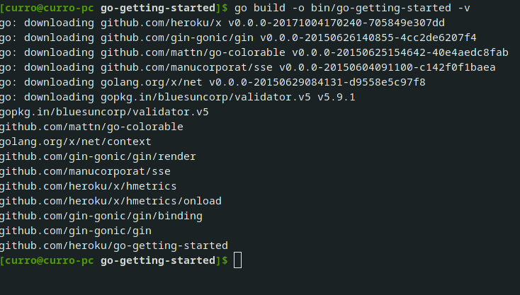
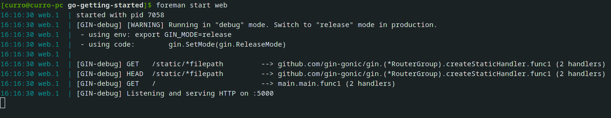

# Ejercicios PaaS

## Ejercicio 1. Darse de alta en algún servicio PaaS tal como Heroku o BlueMix o usar alguno de los PaaS de otros servicios cloud en los que ya se esté dado de alta.

Para este ejercicio, nos daremos de alta en Heroku, en la que básicamente tendremos que introducir una serie de información personal y ya tendremos nuestra cuenta lista

## Ejercicio 2. Crear una aplicación en OpenShift o en algún otro PaaS en el que se haya dado uno de alta. Realizar un despliegue de prueba usando alguno de los ejemplos incluidos con el PaaS.

Seguiremos utilizando Heroku como PaaS, y para desplegar alguno de los ejemplos que nos ofrece, tendremos que clonar el correspondiente repositorio de Github donde este se encuentra:

Habiendo realizado esto, con el CLI de heroku previamente instalado y configurado con nuestro usuario y contraseña, podremos desplegar este ejemplo de manera muy sencilla. Nos dirigimos a la carpeta donde hemos realizado el clonado y ejecutamos los siguientes comandos con los que, crearemos una aplicación y desplegaremos el código del repositorio. Nosotros para crear la aplicación de ejemplo hemos usado los valores por defecto, pero podemos introducir como argumento el nombre de la aplicación (después de poner create); además de tener la posibilidad de cambiar de región (a Europa por ejemplo) con la opción --region eu. Añadir además que con create se genera un repositorio de git al cual se hará push cada vez que se quiera desplegar; que es lo que hacemos en el segundo paso, desplegar al repositorio remoto etiquetado como heroku a la correspondiente rama main.

Ya tendremos acceso al ejemplo, que fácilmente se puede ver con el comando heroku open.

## Ejercicio 3. Instalar y echar a andar tu primera aplicación en Heroku.

Mirar ejercicio 2.

## Ejercicio 4. Usar como base la aplicación de ejemplo de heroku y combinarla con la aplicación en node que se ha creado anteriormente. Probarla de forma local con foreman. Al final de cada modificación, los tests tendrán que funcionar correctamente; cuando se pasen los tests, se puede volver a desplegar en heroku.

En primer lugar, vamos a instalar la herramienta foreman a través del siguiente comando:

Antes de arrancar la aplicación de manera local, tendremos que ejecutar el siguiente comando que construirá la misma:

Con la cual podremos hacer pruebas de manera local de la aplicación con el siguiente comando:

Vemos que en la misma terminal se despliega el log, con el que podremos ver el resultado de la sucesión de eventos en la aplicación desplegada.
